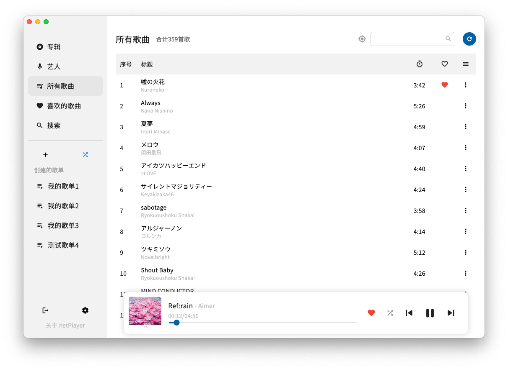

# netPlayer

## 简介


**基于Subsonic API的桌面端播放器**

[**netPlayer Next**](https://github.com/Zhoucheng133/netPlayer-Next) | **★ netPlayer** | [**netPlayer Mobile**](https://github.com/Zhoucheng133/netPlayer-Mobile)

提示：这个版本的netPlayer `v1.x` **不会**再添加功能性更新了，如果软件本身存在致命性的问题我会更新这个仓库，新功能和特性将会在netPlayer Next `v2.0+` 中更新，其源代码见[**netPlayer Next**](https://github.com/Zhoucheng133/netPlayer-Next)

||v1 (当前仓库) |v2|v3|
|-|-|-|-|
|支持Windows版本|Windows7~|Windows10~|Windows10~|
|支持macOS|✅|✅|✅*|
|单曲循环|❌|✅|✅|
|定位歌曲|❌|✅|✅|
|全局快捷键|仅macOS|✅|✅|
|WebSocket服务|❌|❌|✅|

\* 由于本人换电脑，macOS没法打包，如果你有需要可以在自己的设备上打包v3版本(所以也不清楚macOS版本的运行情况，欢迎给予反馈!)

**注意，鉴于Subsonic没有提供“获取所有歌曲”的API，因此“所有歌曲”是通过获取随机歌曲排序后得到的，只能获取500首歌曲**

## 截图



## 快捷键

- `空格`：**播放/暂停**
- `command →`(macOS)或`Ctrl ➡︎`(Windows)：**下一首** (仅适用于`v2.0.6`或更新的版本)
- `command ←`(macOS)或`Ctrl ←`(Windows)：**上一首** (仅适用于`v2.0.6`或更新的版本)
- `command L`(macOS)或`Ctrl L`(Windows)：**显示/隐藏歌词** (仅适用于`v2.0.6`或更新的版本)

## 在你的设备上配置netPlayer

如果你想要查找`v2.0.0`及之后版本的代码和配置指南，跳转到[**netPlayer Next**](https://github.com/Zhoucheng133/netPlayer-Next)，下文的的配置适用于`v1.x`版本

由于本项目没有区分`正在开发的版本`和`发布的版本`，如果你需要获取可以正确执行的代码，**不要直接下载最新的代码! 请在Tag中选择最新的版本下载（或者在Release中下载Source code）**

### 环境配置

- node@16.18.0，**新版本可能无法运行**

- yarn包管理器<sup>*</sup>

  ```bash
  npm install -g yarn
  ```

<sup>*</sup>**如果你处于国内的网络环境，注意配置yarn和Electron的镜像地址或者代理**

### 运行或Debug

1. 进入项目文件夹

   ```bash
   cd net-player
   ```

2. 下载依赖文件

   ```bash
   yarn install
   ```

3. 运行和Debug

   ```bash
   # Debug模式
   yarn run electron:serve
   # 发布模式
   yarn run electron:build
   ```   


## 更新日志

### 3.0.0 (2024/6/20)
- 重构了整个软件，现在看起来更加美观
- 大幅提高了运行效率
- 添加了音量调节功能
- 添加了歌曲界面艺人显示
- 现在搜索不区分大小写了
- 改进了搜索逻辑
- 修复软件信息在Windows下的显示问题
- 修复歌单为0时添加歌单崩溃的问题
- 修复歌单发生变化时的定位问题

<details>
<summary>过去的版本</summary>

### 2.0.7 (2024/5/12) 【仅对Windows版本的更新】
- 添加全局快捷键
- 添加是否添加全局快捷键的开关

### 2.0.6 (2024/3/28)
- 添加显示/隐藏歌词的快捷键
- 添加Windows上切换歌曲的快捷键
- 修复macOS系统上点击菜单无效的问题

### 2.0.5 (2024/3/18)
- 添加了托盘功能和Windows上的关闭隐藏窗口的功能
- 修复没有登录时歌曲操作的问题

### 2.0.4 (补充更新) (2024/3/10)
- 添加清理封面图片缓存的功能(macOS系统)
- 添加在Windows上Debug的配置开发条件

### 2.0.4 (2024/3/9)
- ~~现在可以复制一些文本~~
- 修复没有进入歌词第一句时的滚动状态问题
- 修复无法在文本框输入空格的问题
- 本地化一些系统控件语言

### 2.0.3 (2024/3/7)
- 修复歌词滚动问题
- 修复macOS语言问题
- 修复macOS从菜单切换页面的问题

### 2.0.2 (2024/3/6)
- 统一Windows和macOS一些组件
- 修复运行在Windows系统上稳定性的问题
- 修复进度条崩溃的问题
- 提高了程序运行效率

### 2.0.1 (2024/2/28)
- 恢复全局搜索功能
- 恢复检查更新功能
- 恢复歌词显示功能
- 修复窗口没有聚焦的问题
- 修复播放栏信息显示问题
- 修复播放栏封面图片圆角问题
- 修复定位图标是否可用没有区分的问题
- 修复Windows上窗口按钮图标错误的问题

### 2.0.0 Beta (2024/2/26)
- 使用Flutter重构了整个项目
- 添加单曲循环播放模式
- 添加记住播放模式功能
- 添加了歌曲项中右键菜单
- 改进歌曲显示的布局
- 改进滚动到播放歌曲
- 🚫全局搜索功能暂时无法使用
- 🚫检查更新功能暂时无法使用
- 🚫Windows版隐藏到状态栏暂时无法使用
- 🚫歌词功能暂时无法使用
</details>

## Subsonic API

[关于所有的API点此](http://www.subsonic.org/pages/api.jsp)

## 歌词API

[关于歌词的API点此](https://lrclib.net/docs)
