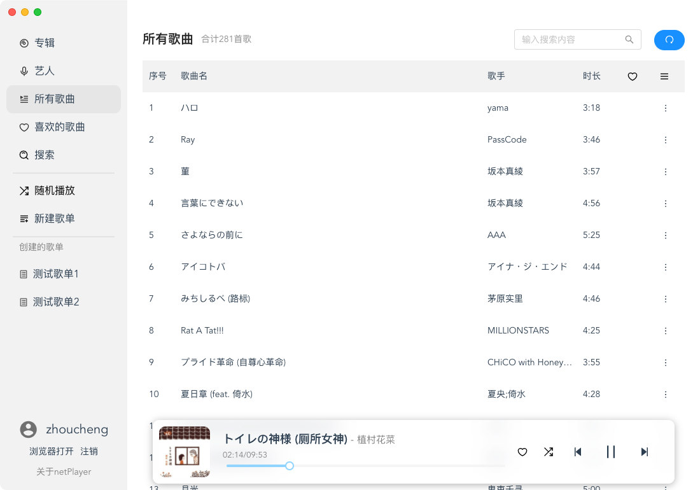

# netPlayer

## 简介

**基于Subsonic API的桌面端播放器**

**注意，鉴于Subsonic没有提供“获取所有歌曲”的API，因此“所有歌曲”是通过获取随机歌曲排序后得到的，只能获取500首歌曲**

关于移动Lite的netPlayer，你可以在这里查看：[Gitee](https://gitee.com/Ryan-zhou/net-player_-lite) / [Github](https://github.com/Zhoucheng133/neyPlayer_Lite)  
关于移动版的netPlayer，你可以在这里查看：[Gitee](https://gitee.com/Ryan-zhou/net-player-mobile) / [Github](https://github.com/Zhoucheng133/netPlayer-Mobile)  
关于PWA版本的netPlayer，你可以在这里查看：[Gitee](https://gitee.com/Ryan-zhou/net-player-pwa) / [Github](https://github.com/Zhoucheng133/netPlayer-PWA)

|                          | netPlayer                       | netPlayer Mobile                                             | netPlayer Lite                                               | netPlayer PWA         |
| ------------------------ | ------------------------------- | ------------------------------------------------------------ | ------------------------------------------------------------ | --------------------- |
| 兼容系统                 | Windows macOS Linux ⭕ | iOS Android Web (PWA) 1 Windows❗ macOS❗ Linux❗ | iOS Android Web (PWA) ⭕ Windows❗ macOS❗ Linux❗ | Web (PWA)1 |
| 基于                     | Vue & Electron                  | Flutter                                                      | Flutter                                                      | Vue                   |
| 登录                     | ✅                               | ✅                                                            | ✳️                                                            | ✅                     |
| 通过系统控制1 | ✅                               | ✅                                                            | ✅                                                            | ✅                     |
| 查看所有歌曲             | ✅                               | ✅                                                            | ❌                                                            | ✅                     |
| 查看歌单                 | ✅                               | ✅                                                            | ❌                                                            | ✅                     |
| 查看喜欢的歌曲           | ✅                               | ✅                                                            | ❌                                                            | ✅                     |
| 搜索                     | ✅                               | ✅                                                            | ❌                                                            | ✅                     |
| 播放顺序                 | 顺序/随机                       | 顺序/随机                                                    | 随机                                                         | 顺序/随机             |
| 添加到喜欢               | ✅                               | ✅                                                            | ❌                                                            | ✅                     |
| 添加到歌单               | ✅                               | ✅                                                            | ❌                                                            | ✅                     |
| 删除歌单                 | ✅                               | ✅                                                            | ❌                                                            | 放弃开发              |
| 编辑歌单                 | ✅                               | ✅                                                            | ❌                                                            | ❌                     |

⭕：理论上支持，但是没有做测试  
❗：理论上支持，但是不推荐在该平台上运行

✅：支持  
❌：不支持  
✳️：有限的支持

1：对于所有需要运行在iOS设备上的PWA应用程序，**可能**因为苹果的后台管理政策无法实现自动播放下一首和系统控制功能，如果你希望在iOS设备上正确的工作，可以使用纯Web模式使用浏览器打开

**相对于Mobile版本，PWA版本在iOS平台以PWA方式安装的时候如果放在前台可以自动切换下一首**

## 截图

## 更新日志

**⚠️注意，版本v1.2.1之前的版本在你标记喜欢的歌曲(Star)数量为0的时候会出现白屏的情况，在v1.2.1版本修复**

### 1.2.3 (2023/10/28)
- 修复一个布局问题
- 更改显示播放方式

### 1.2.2 (2023/10/22)
- 按照添加顺序显示所有歌曲
- 添加系统控制中心控制音乐播放和显示歌曲信息
- 可以自定义随机播放还是顺序播放

### 1.2.1 (2023/8/30)
- 修复当喜欢的音乐为0无法显示的情况

### 1.2.0 (2023/8/18)
- 在任何地方可以看到喜欢的歌曲
- 可以添加活着取消喜欢歌曲
- 可以新建、删除或重命名播放列表
- 添加一些操作功能，包括
  - 播放当前歌曲
  - 添加到喜欢的歌曲
  - 从喜欢的歌曲中删除
  - 添加到现有的歌单
  - 从现有的歌单中删除

### 1.1.0 (->合并到版本1.2.0)
- 添加搜索功能
- 可以在搜索内容中播放
- 修复一些错误

### 1.0.1 (2023/8/13)
- 可以在歌单中搜索
- 改进菜单

### 1.0.0 (2023/8/12)
- 第一个版本

## Subsonic API

[关于所有的API点此](http://www.subsonic.org/pages/api.jsp)