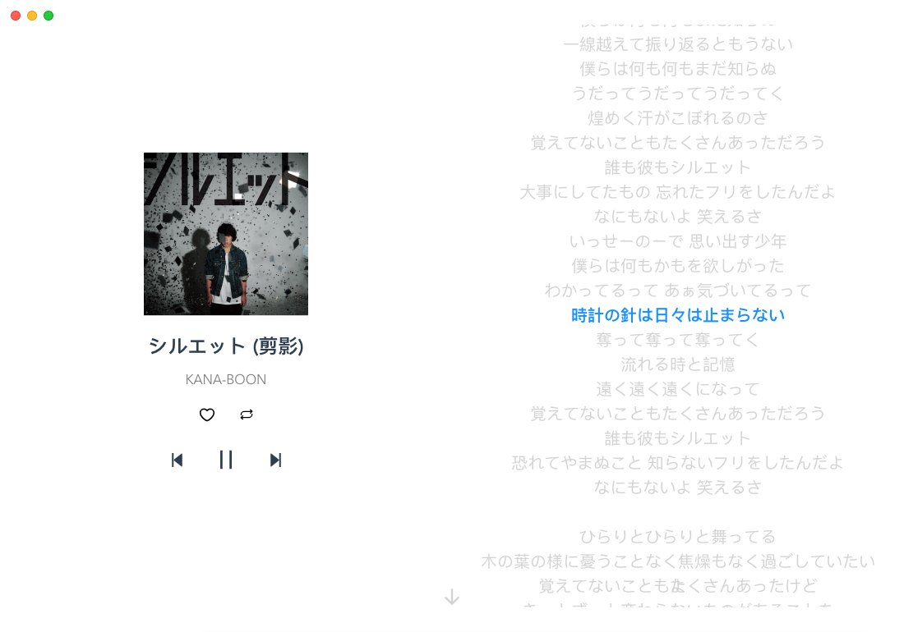

# netPlayer

## 简介


**基于Subsonic API的桌面端播放器**

[**netPlayer Next**](https://github.com/Zhoucheng133/netPlayer-Next) | **★ netPlayer** | [**netPlayer Mobile**](https://github.com/Zhoucheng133/netPlayer-Mobile)

**注意，鉴于Subsonic没有提供“获取所有歌曲”的API，因此“所有歌曲”是通过获取随机歌曲排序后得到的，只能获取500首歌曲**

提示：`2.0.0`之后的版本的源代码见[**netPlayer Next**](https://github.com/Zhoucheng133/netPlayer-Next)

## 截图


**点击歌曲封面可以查看歌词**



## 在你的设备上配置netPlayer

由于本项目没有区分`正在开发的版本`和`发布的版本`，如果你需要获取可以正确执行的代码，**不要直接下载最新的代码! 请在Tag中选择最新的版本下载（或者在Release中下载Source code）**

### 环境配置

- node@16.18.0，**新版本可能无法运行**

- yarn包管理器<sup>*</sup>

  ```bash
  npm install -g yarn
  ```

<sup>*</sup>**如果你处于国内的网络环境，注意配置yarn和Electron的镜像地址或者代理**

### 运行或Debug

1. 进入项目文件夹

   ```bash
   cd net-player
   ```

2. 下载依赖文件

   ```bash
   yarn install
   ```

3. 运行和Debug

   ```bash
   # Debug模式
   yarn run electron:serve
   # 发布模式
   yarn run electron:build
   ```

   


## 更新日志

### 2.0.0 (开发中)
- 使用Flutter重构了整个项目
- 添加单曲循环播放模式
- 添加记住播放模式功能
- 添加了歌曲项中右键菜单
- 改进歌曲显示的布局
- 改进滚动到播放歌曲

### ~~1.5.1 (2024/2/20)~~
- ~~改进侧栏显示方式~~
- ~~改进一些动画显示的效果~~

### 1.5.0 (2024/1/26)
- 添加设置界面
- 添加打开软件连接失败是否重试的提示
- 修复Windows上歌词界面无法显示窗口控制
- 修复添加到歌单时没有自动刷新歌单的问题
- 修复歌单没有内容时加载错误的问题
- 修复从一个歌单添加到另外一个歌单时候弹窗没有自动关闭的问题
- 改进歌词滚动效果

### 1.4.0 (2024/1/4)
- 添加歌词显示界面(**点击歌曲封面图即可查看歌词**)
- 添加记住播放模式功能

### 1.3.4 (2023/12/30)
- 添加查看播放位置
- 添加Windows的底部托盘
- 修复艺人显示的问题
- 改进底部播放栏显示效果
- 改进交互UI

### 1.3.3 (2023/11/23)
- 添加所有歌曲≥500首歌曲的提示

### 1.3.2 (合并到1.3.3)
- 修复歌单页面搜索选中问题
- 修复播放时无法自动顺序播放
- 可以在播放栏上star/unstar

### 1.3.1 (2023/11/21)
- 添加完全随机播放
- 自动加载上一次播放的歌曲
- 完善一些图标显示

### 1.3.0 ~~(2023/11/6)~~ (2023/11/7)
- 重构界面结构
- 大幅提高页面切换速度
- 现在刷新歌单不会停止播放了
- 改进进度条样式
- 现在可以“滑动”进度条了
- 修复unstar歌曲的问题

### 1.2.3 (2023/10/28)
- 修复一个布局问题
- 更改显示播放方式

### 1.2.2 (2023/10/22)
- 按照添加顺序显示所有歌曲
- 添加系统控制中心控制音乐播放和显示歌曲信息
- 可以自定义随机播放还是顺序播放

### 1.2.1 (2023/8/30)
- 修复当喜欢的音乐为0无法显示的情况

### 1.2.0 (2023/8/18)
- 在任何地方可以看到喜欢的歌曲
- 可以添加活着取消喜欢歌曲
- 可以新建、删除或重命名播放列表
- 添加一些操作功能，包括
  - 播放当前歌曲
  - 添加到喜欢的歌曲
  - 从喜欢的歌曲中删除
  - 添加到现有的歌单
  - 从现有的歌单中删除

### 1.1.0 (->合并到版本1.2.0)
- 添加搜索功能
- 可以在搜索内容中播放
- 修复一些错误

### 1.0.1 (2023/8/13)
- 可以在歌单中搜索
- 改进菜单

### 1.0.0 (2023/8/12)
- 第一个版本

## Subsonic API

[关于所有的API点此](http://www.subsonic.org/pages/api.jsp)

## 歌词API

[关于歌词的API点此](https://lrclib.net/docs)
